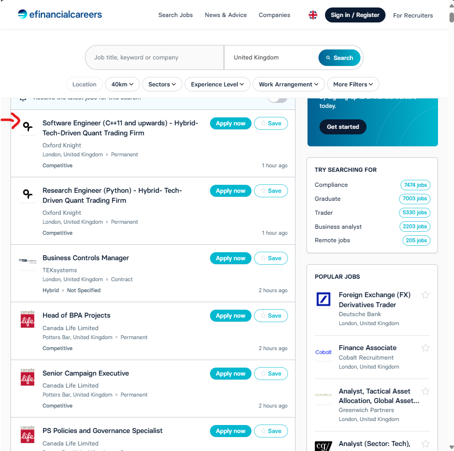

<p align="right"><a href="https://github.com/ojudz08/AutomationProjects/tree/main">Back To Main Page</a></p>


<!-- PROJECT LOGO -->
<br />
<div align="center">
<h1 align="center">PDF Splitter</h1>
</div>


<!-- ABOUT PROJECT -->
### About Project

Splits the pdf.

### What are the pre-requisites?

```Python version 3.11.9```

Note: **conda env** was used within VSCode to isolate the modules and dependencies used when creating this script. You may opt to create your conda env. Refer to this link [how to create conda env in VSCode.](https://code.visualstudio.com/docs/python/environments)

Run the command below in following order. 

```bat
python -m pip install -r requirements.txt
pyinstaller main.py --noconsole --clean --onefile --name pdf_splitter -y
python scripts/file_transfer.py
```

Or you may simply run the run.bat which also contains the commands below.

```bat
@echo off
echo Install requirements...
python -m pip install -r requirements.txt

echo Create pdf_parser.exe...
pyinstaller main.py --noconsole --clean --onefile --name pdf_splitter -y

python scripts/file_transfer.py
```

### Running the Script
1. Save your reports within __*reports*__ folder.

2. This will install all the necessary python libraries used.
   ```Python
   python -m pip install -r requirements.txt
   ```

3. Create an executable file pdf_parser.exe from the main.py
   ```Python
   pyinstaller main.py --noconsole --clean --onefile --name pdf_splitter -y
   ```

4. Move the created executable file in the current directory.
   ```Python
   python scripts/file_transfer.py
   ```

### How to use pdf_splitteer
1. After running the script above, you will see a **_pdf_splitter_** application.

2. This is what the UI looks like.
   
   


3. Click Open File and it'll prompt to open the file


4. Input the pages you want to split.

     
5. Then click Submit. 

<!-- CONTACT -->
### Disclaimer

This project was created using Windows, the run.bat will only work with Windows. Please contact Ojelle Rogero - ojelle.rogero@gmail.com for any questions with email subject "Github Parsing PDFs".