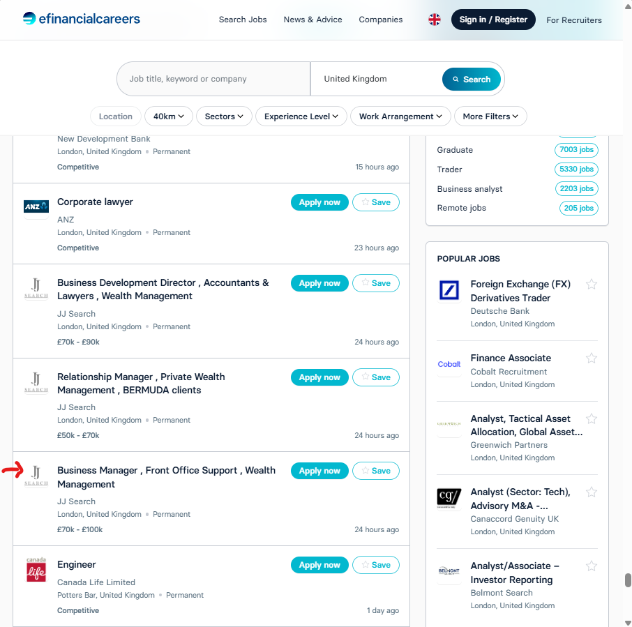
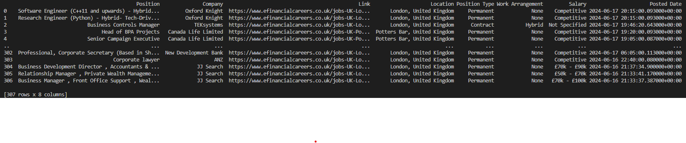

<p align="right"><a href="https://github.com/ojudz08/AutomationProjects/tree/main">Back To Main Page</a></p>


<!-- PROJECT LOGO -->
<br />
<div align="center">
<h1 align="center">eFinancial Careers Webscraper</h1>
</div>


<!-- ABOUT PROJECT -->
### About Project

Scrapes the job details from efinancialcareers UK for the last 24 hours:
- Position Title
- Company
- Job link
- Location
- Position Type (Permanent, Contract, Temporary, etc.)
- Work Arrangement (Hybrid, In-Office, Flexible, Remote)
- Salary
- Posted Date (in utc)


### What are the pre-requisites?

```Python version 3.11.9```

Note: **conda env** was used within VSCode to isolate the modules and dependencies used when creating this script. You may opt to create your conda env. Refer to this link [how to create conda env in VSCode.](https://code.visualstudio.com/docs/python/environments)

Install the needed libraries. 

```
python -m pip install -r requirements.txt
```


### What the job site looks like before running the script

This is what the job site looks like before running the script. The first job entry is **Software Engineer (C++11 and upwards) - Hybrid- Tech-Driven Quant Trading Firm** and the last job is **Business Manager, Front Office Support, Wealth Management**.

   

   

    

### Result

Scraped 307 job titles for the last 24 hours.

   

### Limitations

Beautifulsoup has limited capability in scraping websites with show more button (or infinite scroll). This api_url function is added to parse the job details directly from the api url. 

The sole purpose of this project is **to scrape only the recent job post for the last 24 hours** and didn't upload the vars.yaml file within the repo. If you want to try this scraper, please reach out to me.

```python
def api_url(self, pg):
   with open("vars.yaml", "r") as f:
      vars = yaml.load(f, Loader = yaml.FullLoader)

   url, iter = "", 0
   for key, val in vars.items():
      if iter == 0: pass
      elif iter == 4: url += val + str(pg) + "&"
      else: url += val

      iter += 1
   return url
```


### Next update
Will put the data into a dashboard.


<!-- CONTACT -->
### Disclaimer

Please contact Ojelle Rogero - ojelle.rogero@gmail.com for any questions with email subject "Webscraping".
